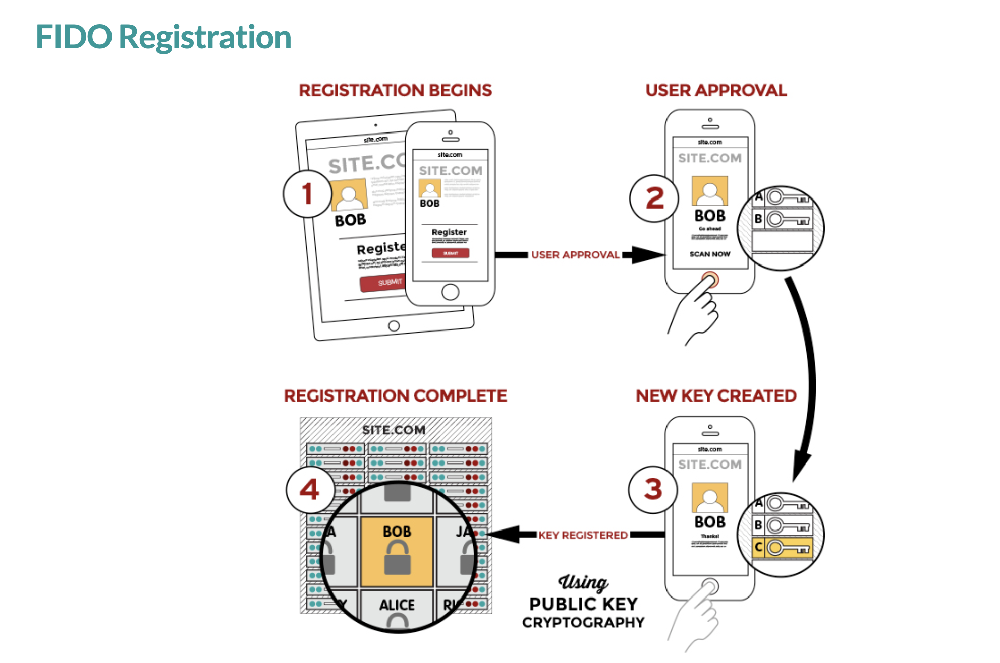
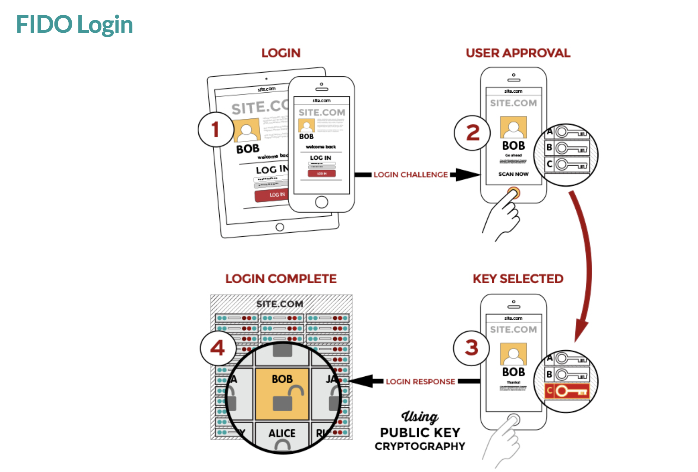
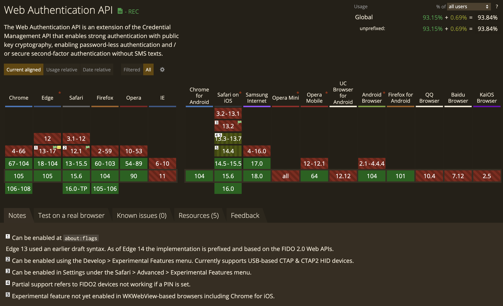

# WebAuthn experimentation

[](https://twitter.com/qdqd___)

## Introduction

This repository is an experimentation that shows how the Web Authentication API works (called WebAuthn), and how this specification can be used to create a passwordless **and usernameless** authentification experiences (thanks to the resident keys). The code in this repository is not production-ready. Please, take into consideration concerns and comments in the [note](#notes) section before using it in production.

[](https://www.youtube.com/watch?v=zJPNuORkvvk)

<p align="center">
    Watch this introduction to understand what is WebAuthn
</p>

## Installation

All you need to do is install the dependencies needed

```shell
pnpm i
```

## Run the application

Run the frontend locally by running

```
pnpm dev
```

## Test

You can run the tests by running this command

```shell
# WIP
pnpm run test
```

## What is WebAuthn

The Web Authentication API (also known as WebAuthn) is a specification written by the W3C and FIDO, with the participation of Google, Mozilla, Microsoft, Yubico, and others. It is a way better alternative for securing sensitive information online.

It allows servers to integrate with the strong authenticators now built into devices, like Windows Hello or Apple’s Touch ID. Instead of a password, a private-public key pair (known as a credential) is created for a website. The private key is stored securely on the user’s device; a public key and randomly generated credential ID are sent to the server for storage. The server can then use that public key to prove the user’s identity.

The public key is not secret, because it is effectively useless without the corresponding private key. The fact that the server receives no secret has far-reaching implications for the security of users and organizations. Databases are no longer as attractive to hackers because the public keys aren’t useful to them.

As the Web Authentication API (also referred to as WebAuthn) uses [asymmetric (public-key)](https://en.wikipedia.org/wiki/Public-key_cryptography) instead of passwords or SMS texts for registering, authenticating, and [second-factor authentication](https://en.wikipedia.org/wiki/Multi-factor_authentication) with websites, that unlock some benefits:

- Protection against phishing: An attacker who creates a fake login website can't login as the user because the signature changes with the [origin](https://developer.mozilla.org/en-US/docs/Glossary/Origin) of the website.
- Reduced impact of data breaches: Developers don't need to hash the public key, and if an attacker gets access to the public key used to verify the authentication, it can't authenticate because it needs the private key.
- Invulnerable to password attacks: Some users might reuse passwords, and an attacker may obtain the user's password for another website (e.g. via a data breach). Also, text passwords are much easier to brute-force than a digital signature.

WebAuthn is part of the FIDO2 framework, which is a set of technologies that enable passwordless authentication between servers, browsers, and authenticators. Nowadays WebAuthn is well supported.

## How WebAuthn works

### Registration flow



1. User is prompted to choose an available FIDO authenticator that matches the online service’s acceptance policy.
2. User unlocks the FIDO authenticator using a fingerprint reader, a button on a second–factor device, securely–entered PIN or other method.
3. User’s device creates a new public/private key pair unique for the local device, online service and user’s account.
4. Public key is sent to the online service and associated with the user’s account. The private key and any information about the local authentication method (such as biometric measurements or templates) never leave the local device.

### Authentification flow



1. Online service challenges the user to login with a previously registered device that matches the service’s acceptance policy.
2. User unlocks the FIDO authenticator using the same method as at Registration time.
3. Device uses the user’s account identifier provided by the service to select the correct key and sign the service’s challenge.
4. Client device sends the signed challenge back to the service, which verifies it with the stored public key and logs in the user.

## Support of WebAuthn

[](https://caniuse.com/webauthn)

<p align="center">
    Snapshot taken on september 2022
</p>

## Notes

This application is an experimentation, the code IS NOT PRODUCTION READY. If you want to use it as a base, please read the ressources linked below and pay attention to the comments that includes `@TODO`. They need to be solved before envisaging using WebAuthn for real.

I made the choice, on the main branch, to use as few dependencies as possible. This means that I only use the official WebAuthn API, with its good and bad sides. One of the problems of the current state of the API is that some of the data returned by the autenticator is of type `ArrayBuffer`. Even if this type is interesting for the WebAuthn use case, this makes it difficult for the manipulation and the communication with the backend. You can read more about this in the ongoing conversation about modifying the spec [here](https://github.com/w3c/webauthn/issues/1683). If you want to use this repository as a base, but want a version where the data returned by the autenticator is more "developer-friendly", I have pushed a branch that uses [webauthnjson](https://github.com/github/webauthn-json) [here](https://github.com/qd-qd/webauthn/tree/version-with-webauthnjson).

## Ressources

## Official resources

[Web Authentication: An API for accessing Public Key Credentials. Level 2 W3C specification](https://www.w3.org/TR/webauthn-2/)

[Web Authentication: An API for accessing Public Key Credentials. Level 3 W3C specification - DRAFT](https://w3c.github.io/webauthn/#sctn-intro)

[Web Authentication API - MDN Documentation](https://developer.mozilla.org/en-US/docs/Web/API/Web_Authentication_API)
[FIDO alliance official website](https://fidoalliance.org/fido2/)

## Interesting resources

[What is WebAuthn? - an illustrated explanation](https://webauthn.guide/#intro)

[What is WebAuthn? - by](https://www.yubico.com/authentication-standards/webauthn/) @Yubico

[Introduction to WebAuthn API and Passkey](https://medium.com/webauthnworks/introduction-to-webauthn-api-5fd1fb46c285)

[How FIDO works](https://fidoalliance.org/how-fido-works/)

[An web implementation of WebAuthn that uses nextjs](https://github.com/cotter-code/guide-next-webauthn)

[Discussion on the serialization/deserialization of webAuthn authenticator response](https://github.com/w3c/webauthn/issues/1683)

[User Presence vs User Verification](https://developers.yubico.com/WebAuthn/WebAuthn_Developer_Guide/User_Presence_vs_User_Verification.html)
